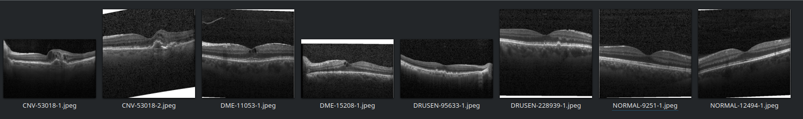

  

# Retinal Optical Coherence Tomography (OCT) Classification

This dataset1 contains images of retinal optical coherence tomography, a technique used to capture high-resolution cross sections of retinas that can be used to detect different diseases.

The data can be used to build and train an ML model that can detect ocular diseases.

# Structure

This repo contains the following structure:

- **dataset.csv**: CSV file that maps OCT classification labels to the training images.
- **data**: contains the training images, partitioned into sub directories for the respective ocular diseases. The following are a few example images:

  

The table below shows a partial example of the data stored in **dataset.csv** that is used to map classification labels to training images:

| **labels**  | **images** |
| ----------  | ---------- |
| CNV | data/train/CNV/CNV-451136-177.jpeg |
| DME | data/train/DME/DME-4792882-74.jpeg |
| DRUSEN | data/train/DRUSEN/DRUSEN-7629851-3.jpeg  |
| NORMAL | data/train/NORMAL/NORMAL-8088630-3.jpeg |

The labels used in the CSV are:

- **CNV**: Choroidal Neovascularization
- **DME**: Diabetic Macular Edema
- **DRUSEN**: Multiple drusen present in early AMD
- **NORMAL**: Normal retina

# Community

Got questions, feedback, or want to join a community of machine learning practitioners working with exciting tools and projects? Check out our [Community](https://forum.perceptilabs.com/)!

1 Dataset Credits: https://www.kaggle.com/paultimothymooney/kermany2018

